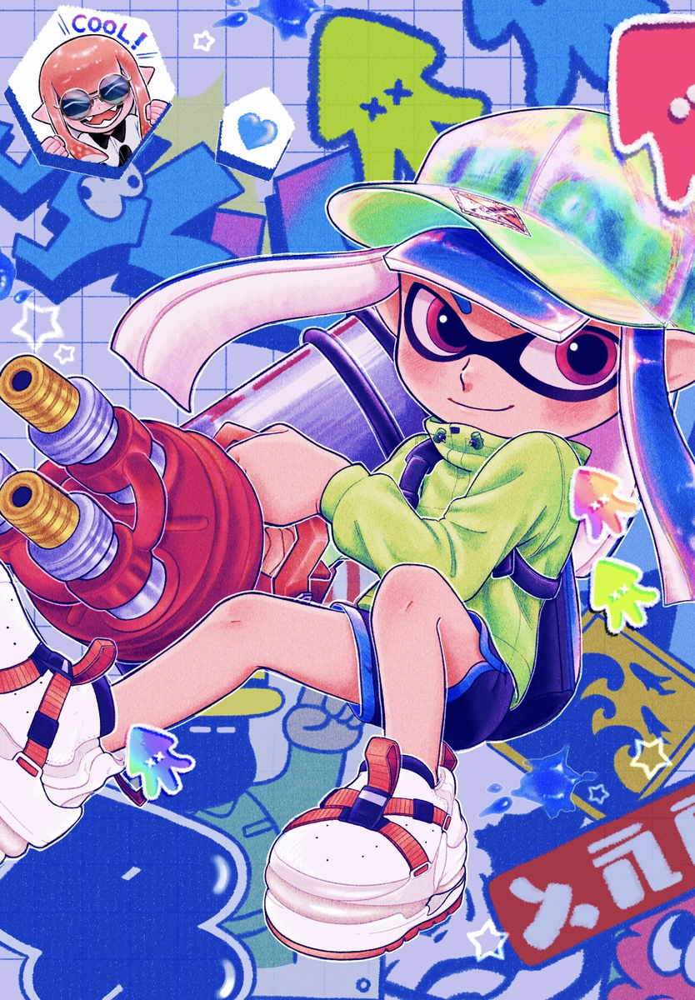

## Hi there 👋

<!--
**jackeyzzz12138/jackeyzzz12138** is a ✨ _special_ ✨ repository because its `README.md` (this file) appears on your GitHub profile.

Here are some ideas to get you started:

- 🔭 I’m currently working on ...
- 🌱 I’m currently learning ...
- 👯 I’m looking to collaborate on ...
- 🤔 I’m looking for help with ...
- 💬 Ask me about ...
- 📫 How to reach me: ...
- 😄 Pronouns: ...
- ⚡ Fun fact: ...
-->

### About me
- 🌱 I’m currently learning JavaScript and philosophy.
- 📫 How to reach me: mail@jack1.top
- 💻 browse my blog: https://jackeyzzz12138.github.io
- I'm a freshman in CTF, and keen on Geek things.
- Embrace open source.
- **Splatoon 3 forever!**

## About code

*Thanks for your visit:*  

